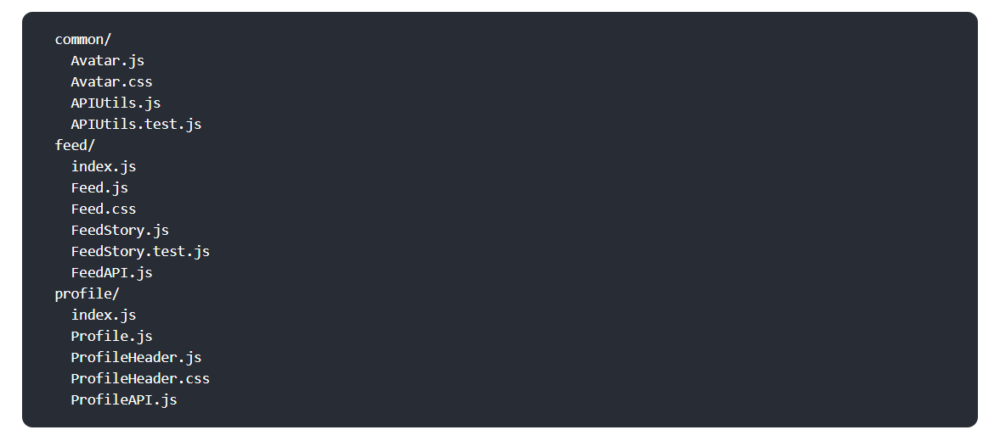
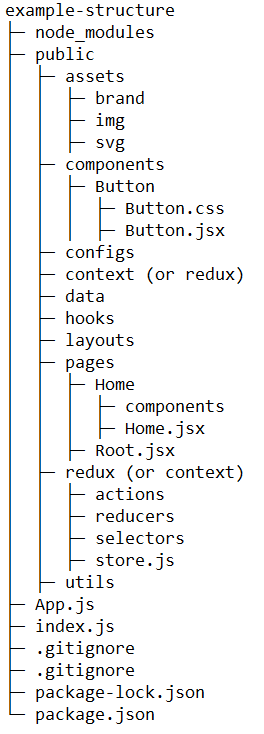

# thinking-folder-structure-in-react

### Mô tả
- Ghi chú về cách tổ chức thư mục trong react, từ đây áp dụng cho các framework frontend khác.
- Tư duy về tổ chức có thể thay đổi trong tương lai, theo trình độ, theo dự án.
- React chỉ là ví dụ, tư duy này có thể áp dụng cho các framework khác.
- Hiện tại cấu trúc của thư mục không quan tâm đến việc cấu trúc các file test.

### Tư duy trong react
Các bước xây dựng UI theo tư duy của react
**1. Phân chia các thành phần trên trang web thành các component**

**2. Xây dựng một khung trang web tĩnh từ việc tạo và ghép các component lại với nhau**

**3. Tìm kiếm và tạo các UI state**
- ##### Những thứ sau không phải là một state:
    - Không thay đổi trong suốt quá trình ứng dụng được chạy
    - Được truyền từ component cha (này gọi là props)
    - Có thể được tính toán từ những state hoặc props đã tồn tại trước đó
- ##### state và props
    - Props are like arguments you pass
    - State is like a component’s memory
    - **Nên nhớ trong react chỉ có một luồng đi duy nhất của state và props là từ component cha → component con (data flows one way: from owner to child)**

**4. Tìm và quyết định state sẽ được đặt ở component nào**

**5. Cập nhật dữ liệu theo hai chiều**
react theo nguyên tắc "data flows one way: from owner to child"

### React Folder Structure
- Có nhiều cách tổ chức thư mục trong react và không có nguyên tắc nào là hoàn toàn đúng hay hoàn hảo!

- Một số gợi ý cơ bản về tổ chức thư mục có thể kể đến như:
    - Nhóm theo features or routes

    - Nhóm theo file type

    - Tránh lồng quá nhiều (khoảng 2 đến 3 thư mục là vừa)
    - Đừng mất thời gian để chỉ cấu trúc thư mục! :)

### Containers và Components
- Đây là hai khái niệm thường được nhắc đến trong react
- **Containers** là những thành phần chủ yếu chứa state để điều khiển hoạt động của ứng dụng. **Chúng thường là thẻ div**
- **Components hay presentational components** là những thành phần chịu trách nhiệm hiển thị nội dung, định hình UI cho toàn bộ trang web. Chúng thường không chứa hoặc chứa rất ít các xử lý logic

### Cấu trúc thư mục 
Theo ý kiến cá nhân hiện tại, không cố định, thay đổi theo dự án, thay đổi theo trình độ.
- **src/assets**: chứa toàn bộ hình ảnh, icon xài chung cho cả trang web và global.css
- **src/components**: chứa các component xài chung trong toàn bộ website
- **src/config**: chứa các config ban đầu của ứng dụng
- **src/data** (optional): chứa các file json về mockup data hoặc các hằng số cần thiết
- **src/hooks**: chứa các custom hook (nếu có)
- **src/layouts**: chứa các layout của toàn bộ website
- **src/pages**: chứa các page của toàn bộ website, mỗi page bao gồm 1 folder chứa các component của riêng nó và một file root để kết hợp các component này lại tạo thành một page hoàn chỉnh. Có thể có thêm các file css nếu cần thiết
- **src/utils**: chứa các pure function
- **src/context** (without redux vs redux toolkit): chứa cấu hình các gobal state, tương tác APIs 
- **src/redux** (with redux vs redux toolkit): chứa cấu hình redux, tương tác APIs

### Projecy tree:

<!-- example-structure
├─ node_modules
├─ public
│  ├─ assets
│  │  ├─ brand
│  │  ├─ img
│  │  ├─ svg
│  ├─ components
│  │  ├─ Button
│  │  │  ├─ Button.css
│  │  │  ├─ Button.jsx
│  ├─ configs
│  ├─ context (or redux)
│  ├─ data 
│  ├─ hooks 
│  ├─ layouts 
│  ├─ pages
│  │  ├─ Home
│  │  │  ├─ components
│  │  │  ├─ Home.jsx
│  │  ├─ Root.jsx
│  ├─ redux (or context)
│  │  ├─ actions
│  │  ├─ reducers
│  │  ├─ selectors
│  │  ├─ store.js
│  ├─ utils
├─ App.js
├─ index.js
├─ .gitignore
├─ .gitignore
├─ package-lock.json
└─ package.json -->

### Tham khảo
- https://react.dev/learn/thinking-in-react
- https://legacy.reactjs.org/docs/faq-structure.html
- https://viblo.asia/p/tim-hieu-ve-presentational-va-container-component-trong-react-bWrZn4mY5xw
- https://viblo.asia/p/react-cau-truc-thu-muc-du-an-va-dat-ten-component-aWj53GMY56m
- https://www.youtube.com/watch?v=Mm6_DlO5vvs
- https://www.youtube.com/watch?v=UUga4-z7b6s

